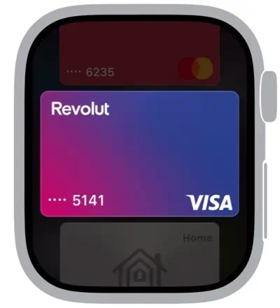

# Aliro

<p float="left">
 
</p>
<sub>Please, don't freak out about the video.</sub>  

> [!NOTE]  
> Aliro protocol is under development and has a 2025 release target. No publicly known implementations are available to users yet.
> 
> This repository serves as a collection of all technical and non-technical information available at this moment, alongside some speculation and guessing. It has a big potential of becoming obsolete in the near future, considering that CSA might open up access to their specification.
> 


# Overview

## Introduction

Aliro is a standardized communication protocol between access readers and user devices;


## Development

The standard is developed by the Connectivity Standards Alliance (CSA) - an organization responsible for the creation of Matter specification.

The companies listed as members of the work group are:
* Consumer device manufacturers:
  - Apple;
  - Google;
  - Samsung;
* Hardware component manufacturers:
  - NXP;
  - ST;
  - Infineon;
* Access control system manufacturers:
  - HID;
  - Allegion.


## Features

The following additional features of Aliro have been mentioned in one way or another, or have been synthesized based on known technical information:

- Sharing `EvictableEndpoint`:
  - "Offline" sharing.
- Automatic generation of credentials for devices added into Matter home installation  `Issuer -> NonEvictableEndpoint`;
- Limitations upon credentials:
  - Time of the day;
  - Day of the week;
  - Limited use (date or count);
  - Additional authentication requirements.
- Cross-platform compatibility;
- Multiple readers per installation;
- Multiple radio technologies:
  - NFC;
  - BLE + UWB.

One thing to keep in mind is that the mention of any of those features does not mean that they'll end up in the final release of the specification, or if a particular OEM is in the right mood to implement all of them:
  - With Car and Home keys, the protocol seemingly offers support for requesting strong authentication (aka, no express mode). Apple devices ignore that parameter and authenticate anyway, although it's possible that this feature is not implemented by anyone in that matter;
  - With Car Keys, one implementation "should" work on all devices and platforms, but there have been cases of a particular manufacturer being compatible with one platform and not the other, potentially as a result of the de-facto requirement to make a deal with each OEM separately.


## Release date

Aliro does not have an official release date, but some public sources related to CSA have reported that Aliro is targeting 2025 release.

Meanwhile, starting from Spring 2024, the internal code of different OEMs had started to gain references to Aliro:

- Android 15 source code gained UWB implementation;
- Google Play Services gained references to Aliro HCE service;
- IOS 17.5 contains Matter support headers related to Aliro lock configuration and credential provisioning;
- IOS 18.0 Beta contains tons of referenes to Aliro, including Applet references;
- ~~IOS might contain references to Aliro (or plain UnifiedAccess, which the Aliro is the derivative of) under the "Hydra" codename~~ (Hydra is a codename affix for symbols related to `UnifiedAccess`-based access passes).

Considering the fact that parts of code related to Aliro have been shipped to customer devices in those cases, means that the protocol implementation is already undergoing active testing.  
~~There's a non-zero chance of Google mentioning Aliro on Google IO in May, or Apple at WWDC in June~~ (Nope).

Taking a broad guess, we could see Aliro releasing anywhen starting from Summer 2024 (as a developer preview, if specification is opened), up to Autumn 2024 (when Android 15, IOS 18 release, alongside their respective flagship devices), or Winter 2024/2025.

Considering that Aliro is intended for both residential and commercial access control, it's also possible that the residential part of the spec gets released earlier, while the access control side could be delayed to add or refine features required in those cases.


# Technical details

## Communication modes

Aliro specification covers two modes of communication between the reader and the endpoint:
- NFC;
- BLE + UWB.

While the NFC part of the specification will be mandatory, BLE + UWB for passive entry will be optional.

The standard does not specify how the reader is to communicate or integrate with the outside world, so it may use any of the following:
* Wired: Ethernet, OSDP, Wiegand, etc.
* Wireless: Pure BLE, WiFi, Thread, ZigBee.


## Matter integration

While Aliro specifically mentions lack of any limitations on how the reader integrates with the external world, it doesn't mean that the reverse is true.

Matter protocol will feature direct integration with Aliro-compatible hardware. [First pull requests that include references to Aliro have hit the connectedhomeip repository as early as this January](https://github.com/project-chip/connectedhomeip/pull/31144/files).


## NFC

### ECP and PLF

There is no information in regards to the use of Enhanced Contactless Polling or Polling Loop Filters with Aliro.  
Considering that Apple had historically used ECP for all* express-mode-enabled passes and that Google is steamrolling PLF implementation into Android 15's NFC stack, there's a high chance that both device groups will employ the use of their respective polling augmentation technology alongside Aliro.

What poses a question is whether NFC polling augmentation will fall outside the Aliro specification and become a matter of direct agreement between each hardware manufacturer and Apple and Google, or if both sides may opt to support each other's technologies or even share a common data format for ideal interoperability.


### Applets and Application Identifiers

According tho the fresh (May) release of Google Play Services, Aliro will use two application identifiers:
1. Primary:  
  `A000000909ACCE5501`
2. Secondary:  
   `A000000909ACCE5502`

```
<?xml version="1.0" encoding="utf-8"?>
<host-apdu-service xmlns:android="http://schemas.android.com/apk/res/android" android:description="@string/aliro_hce_service_description" android:requireDeviceUnlock="false" android:requireDeviceScreenOn="false">
    <aid-group android:category="other">
        <aid-filter android:name="A000000909ACCE5501"/>
        <aid-filter android:name="A000000909ACCE5502"/>
    </aid-group>
</host-apdu-service>
```

Those who are familiar with the `UnifiedAccess` family of NFC protocols, know that the so-similar two-app-combo is also used by:
- Digital Car Keys;
- Apple Home Keys;
- Apple Access Keys.

Where:
- The first applet is hosted on the secure element (SE), and is responsible for storing the credential data and performing authentication.
- The second one is hosted by the operating system (HCE), and is used for credential enrollment and/or storage of auxiliary data.

What's unique about this implementation, is that this time both AID entries are declared as having an on-host implementation.
This could mean one of the following:
- Aliro, unlike other `UnifiedAccess`-derivative protocols, will allow the use of HCE, perhaps with one of the following specifics:
  * There are no restrictions on how credential data is stored;
  * Credential data must be stored at least in semi-secure location, like on the TEE;
  * Credential data must be located in the secure/external hardware, specifics on if the secure hardware must be connected directly to radio or can access radio indirectly through a CPU + Software don't matter. StrongBox Keymaster could be an example of an implementation meeting this criteria, as it stores key data in a secure element, but cryptographic operations are performed on behalf of the operating system.   
- ~~HCE is used by Google internally for testing purposes only. In this case, it would also mean that the cool `ACCE55` AID affixes might not be used~~ (IOS18 firmware confirms that `ACCE55` is the official AID);

All of these theories have an equal chance of being true, considering that Aliro might sidestep some limitations similar to the ones enforced by Car Key spec in order to get much broader support, as there are still many Android devices lacking a dedicated SE, let alone an "Android Ready SE" compatible one, but there are lots that contain a TEE, which can also be used for similar purposes, even if not considered as secure, while being miles better than plain OS-level software-based implementation.  

Regardless of that, SE-backed implementation will surely be an option and used by Apple. It also might be available for premium Android devices, in order to allow operation in low battery situations, but at this moment there are no clues leading to that.


## UWB

Android 15 source code features many references to Aliro in regards to the UWB specification. 

[The codebase](https://cs.android.com/android/platform/superproject/main/+/main:packages/modules/Uwb/service/support_lib/src/com/google/uwb/support/aliro/) features following classes:
- AliroOpenRangingParams;
- AliroParams;
- AliroProtocolVersion;
- AliroPulseShapeCombo;
- AliroRangingError;
- AliroRangingReconfiguredParams;
- AliroRangingStartedParams;
- AliroRangingStoppedParams;
- AliroSpecificationParams;
- AliroStartRangingParams.

Going to the parent directory, we see a `ccc` directory, dedicated to Car Connectivity Consortium's Digital Car Key UWB implementation. The directory contains:
- CccOpenRangingParams
- CccParams
- ... We can stop at this point;

As we can see, the directory structure and even the class name patterns are exactly the same. The file contents are different due to different class and variable names, but no substantial differences have been found.


This information serves as an additional clue to the fact that Aliro is based on the `UnifiedAccess` family of protocols.


## Protocol and cryptography

Thanks to the Matter GitHub repository and IOS 17.5 runtime headers, we know that the following cryptographic data will be used with the protocol:

* Reader configuration request:
  ```general
   request struct SetAliroReaderConfigRequest {
      octet_string<32> signingKey = 0;
      octet_string<65> verificationKey = 1;
      octet_string<16> groupIdentifier = 2;
      optional octet_string<16> groupResolvingKey = 3;
  }
  ```
* Credential data size:
  ```c++
   static constexpr uint8_t DOOR_LOCK_ALIRO_CREDENTIAL_SIZE = 65;
   ...
    case CredentialTypeEnum::kAliroCredentialIssuerKey:
    case CredentialTypeEnum::kAliroEvictableEndpointKey:
    case CredentialTypeEnum::kAliroNonEvictableEndpointKey:
        minLen = maxLen = DOOR_LOCK_ALIRO_CREDENTIAL_SIZE;
  ```

To get more clues, we should draw some parallels with `UnifiedAccess` protocol:
- `signingKey` can be immediately recognized as a direct counterpart of the `SECP256R1` `privateKey`, used by the reader to prove to the endpoint that transaction ephemeral data was generated by a trusted reader. It should also be a 256-bit long private `SECP256XX`, key;
- `verificationKey` seems new. It's 65 bytes long, which is the number of bytes that a `EC` `SECP256**` public key takes. This key is unique in this protocol. Taking a guess, a private portion of that key could be injected into all credentials, so that an endpoint could also prove that its ephemeral data is to be trusted without leaking its identity, even before the final signature which includes identifying data is made by the device over the encrypted channel;
- `groupIdentifier` is not a cryptographic key and has the same meaning as in `UnifiedAccess`, used for the resolution of which particular credential is to be used;
- `groupResolvingKey` could be related to BLE identity resolving key `IRK`;
- `credentialIssuerKey` matches the key of the same name used in Home Key protocol, but in that case that was a 64-byte-long `ED25519` public key. In this case, 65 bytes could also hold an `ED25519` (with 1 byte of slack) or a `SECP256**` key;
- `endpointKey` would contain a public `SECP256**` key of each enrolled endpoint, regardless of it being evictable or not.

Considering that there are many common pieces with `UnifiedAccess` protocol, that's a strong indication that Aliro will have the same or slightly augmented variations of `FAST -> STANDARD -> EXCHANGE` command flow;

A question remains in regards to the ownership `credentialIssuerKey` in Aliro, as it could be one of the following:
- It will belong to the OEM, which will be responsible for generating and attesting credentials (1984);
- It will belong to each user who is directly enrolled in a particular Matter installation and has the ability to invite other users (best-case scenario).
- Only the designated users will be able to serve as issuers, allowing to configure if a home member is allowed to perform sharing (even better).

When comparing to the Home Key protocol, there's also a question on how key revocation would work for evictable credentials, as HomeKey seemingly lacks the ability to remove credentials without removing the issuer, only to blocklist (suspend) a couple of credentials, because the issuer keys serve as a root of trust and credential identifiers are self-assigned based on the private key and not by the issuer.

This issue would be solved if evictable or all credentials instead use a limited identifier pool, which would allow evicting a credential by removing a related identifier from all readers, thus invalidating the attestation package from being replayed.


# IOS18 Symbols and references

The latest IOS18 beta release presents a tresure trove of strings, symbols, and other references to Aliro.  
This section features a collection of all found instances, including some comments if applicable.


## Strings

### `PrivateFrameworks/Home.framework`

#### `HFSensitiveStrings-WalletKeyUWB`

```json
{
    "WalletKeyUncertified": "This accessory has not been certified to work with HomeKit so some features may not be available such as Approach to Unlock or Tap to Unlock.",
    "WalletKeyUWBApproachAngle_Left": "Left",
    "WalletKeyUWB_ApproachAngleView_Title": "Approach Direction",
    "HFAccessoryDetails_Lock_Approach_Angle_Footer": "Customize this lock to only detect an approach from certain directions. This will help prevent the door unlocking accidentally.",
    "WalletKeyUWBApproachAngle_Description": "Customize this lock to only detect an approach from certain directions. This will help prevent the door unlocking accidentally.",
    "WalletKeyUWBApproachAngle_Right": "Right",
    "WalletKeyUWBApproachAngle_Center": "Front"
}
```

1. Aliro-based keys will either not be generated if no certified devices are found in your home, or Apple was kind enough to warn people that some of their locks won't work with "express mode" like functionality if the manufacturer didn't talk to the "right" people;
2. You will be able to configure UWB approach direction that triggers an unlock.


### `PrivateFrameworks/PassKit.framework`

#### `HomeKitUWB`

```json
{
    "UWB_UPDATE_FAILED_BODY_UNLOCK_ONLY_HOME_KEY": "Unlock on Approach uses Ultra Wideband technology. You will not be able to lock & unlock your door until your iPhone has been updated.",
    "DASHBOARD_HOME_ACCESS_RESTRICTED_TITLE": "Access Restricted",
    "DASHBOARD_HOME_ACCESS_RESTRICTED_MESSAGE": "Check your scheduled access times to see when you can use this key.",
    "HOME_KEY_UNLOCK_ON_APPROACH_TITLE": "Unlock on Approach",
    "KNOWN_PROHIBITED_LOCATION_BODY_UNLOCK_ONLY_HOME_KEY": "Unlock on Approach uses Ultra Wideband technology, which is prohibited in this area. Hold iPhone near reader to lock & unlock or move to another location.",
    "BLUETOOTH_DISABLED_BODY_UNLOCK_ONLY_HOME_KEY": "You cannot use Unlock on Approach while Bluetooth is off. Hold iPhone near reader to lock & unlock.",
    "PASS_DETAILS_SHOW_ACCESS_SCHEDULE_TITLE": "Access Schedule",
    "AIRPLANE_MODE_ENABLED_BODY_UNLOCK_ONLY_HOME_KEY": "You cannot use Unlock on Approach while Airplane Mode is on. Hold iPhone near reader to lock & unlock."
}
```

1. Aliro-based keys will support Access Schedules;
2. Aliro-based keys will also be branded as "Home Keys", potentially housing two applets under a single "pass" for UX reasons;
3. NFC will be an alternative to (UWB + BLE)-based authentication;
4. Access schedule feature would be meaningless for full-fledged home members, so this also indirectly implies support for key sharing.  
Although, this doesn't confirm that sharing will be "open", as it is very likely to rely on the new HomeKit "Guest" feature. 


### `Library/SEStorage`

#### `appletMID`

```json
{
  "COPERNICUSALIRO": {
      "instance": [
          "A000000909ACCE5501"
      ],
      "primary": [
          "A000000704D011500000000004000000"
      ],
      "container": [
          "A000000704D011500000000001000000"
      ],
      "isSystemApplet": false
  },
}
```

1. As expected, Aliro is based on `UnifiedAccess` protocol, and Apple implementation uses the same `Copernicus` applet;
2. `A000000909ACCE55` is the AID prefix used by Aliro. 


#### `memoryUsages`

```json
{
  "COPERNICUSALIRO": {
    "selectableMemory": {
        "cod": 17, "cor": 2, "usedIndices": 26, "pHeap": 1038
    },
    "packageMemory": {
        "cod": 0, "cor": 0, "usedIndices": 63, "pHeap": 56972
    },
    "pids": [
        "A000000704EF00010000",
        "A000000704D011500000000004000000"
    ],
    "personalizedMemory": {
        "cod": 4515, "cor": 35, "usedIndices": 11, "pHeap": 352
    },
    "containerMemory": {
        "cod": 2080, "cor": 74, "usedIndices": 52, "pHeap": 1088
    },
    "policy": 0
  }
}
```

1. `A000000704` seems to be a RID used by Apple;
2. Copernicus applet seems to be at least ~57KB big.

> [!TIP]  
> Memory sizes are listed in bytes.
>
> `PERSISTEND`- `pHeap` memory used at all times;
> `CLEAR_ON_DESELECT`- `cod` memory released after the applet is deselected (partially deactivated);  
> `CLEAR_ON_RESET` - `cor` memory released after the card is reset (fully deactivated);  
> 
> `PACKAGE` - memory taken by applet data and executable code;  
> `SELECTABLE` - memory used when applet is selected;  
> `PERSONALIZED` - memory used by each applet instance (all);  
> `CONTAINER` - **If someone familiar with JavaCard knows what it memory type could mean, It would be great if you could chime in and give an explanation.**
>


## Symbols

### `PassKit.framework/PassKitCore`

* `PKPaymentApplicationType`:
  * `Aliro`;
* `PKAuxiliaryCapability`:
  * `HydraAliroEnabled`;
  * `HydraAliroEnabledKey`;
* `PKPassAuxiliaryCapabilitySignatureAliro`:
  * `HomeKeyCreationMetadata`;
  * `HydraKeyCreationMetadata`.
* `ptaAliro`;
* `signatureAliroHydra`;
* `signatureAliroHome`;
* `aliroHome`;
* `readerGroupPublicKey`;
* `aliroGroupResolvingKeys`;
* `purpleTrustAirAliroAppletType`;
* `appletTypePurpleTrustAirAliro`;
* `createAliroHomeKey(seid, readerIdentifier, readerPublicKey, homeIdentifier)`;
* `createAliroHydraKey(seid, serverParameters)`;
* `PKSharingMessageFormatAppleHomeKeyKey`.

1. `Hydra` is a codename for `UnifiedAccess` - based access passes that are not home keys;
2. `Home` version of Aliro credentials will be provisioned locally on a device;
3. `Hydra` version of Aliro credentials will be generated with a participation of a server (which means that dues $$$ will be paid by those who are planning on using Aliro for general-use access);
4. It seems like old Home Keys were intended to be shareable (or related symbols are a stub used for `silent` sharing);
5. As already confirmed by Matter source code, the same cryptographic primitives will be used as in regular `UnifiedAccess` (apart from the new `verificationKey`, which is strangely missing here).


### `DigitalAccess.framework/DigitalAccess`

* `getAliroSupportedProtocolVersions`;
* `updateAliroCredentialDocumentStatus(seid, keyIdentifier, accessDocumentPresent, accessDocumentSignedTimestamp, revocationDocumentPresent, revocationDocumentSignedTimestamp)`;

1. Aliro's attestation packages will seemingly be called `accessDocument`, as they could also be `signed`;
2. Presence of `revocationDocument` and `seid` in parameters could mean that Aliro is using secure element for storage of attestation packages. 
3. Considering that this framework contains many references to `sharing` and `attestation`, but no references to `purpleTrust`, could mean that the latter has nothing to do with attestations and something to do with crypto key storage instead.


### `Home.framework/Home`

* `supportsUWBUnlock`;
* `setExpressSettingsAuthData(enableUWB, enableNFCExpress)`;
* `containsWalletKeyUWBAccessory`;
* `accessoriesSupportingUWBUnlock`;

1. Aliro Home keys are also referenced as "UWB Home Keys".


### `HomeKitMatter.framework/HomeKitMatter`

* `doorLockFeatureMapSupportsAliro`:
  * `BLEUWB`;
  * `Provisioning`;
* `readAttributeAliro`:
  * `ReaderVerificationKey`;
  * `ReaderGroupSubIdentifier`;
  * `GroupResolvingKey`;
  * `ReaderGroupIdentifier`;

1. Aliro BLE + UWB feature is optional;
2. Aliro locks might have "group sub-identifiers";
3. `verificationKey` is only referenced here, and could be used as a "privacy" key injected into all credentials, but it's not referenced anywhere else.  


# Notes 

- I take no ownership of any information presented here. Presented code snippets, if available, were taken directly from public sources referenced below; 
- The following software was analysed on the presence of Aliro-related code.
  * IOS 17.5 restore firmware file for iPhone 15 Pro Max:
    `iPhone16,2_17.5_21F5073b_Restore.ipsw`.
  * IOS 18.0 Beta 1 restore firmware file for iPhone 15 Pro Max:
    `iPhone16,2_18.0_22A5282m_Restore`.
  * Google Play Services APK files starting from February 2024:
    `com.google.android.gms_24.15.17`.    
- The term "OEM" is used exclusively here to refer to consumer device manufacturers, such as Apple, Google, Samsung, etc;
- If you find any typos, mistakes, or have additional info to share, feel free to create a PR or raise an issue.


# Special thanks

* [@kupa22](https://github.com/kupa22) - for helping with looking into and finding IOS18 framework symbols;
* [@vincentpeyrouse](https://github.com/vincentpeyrouse) - for being first to report on some IOS18-related discoveries (strings and JSON files), finding clues leading into `DigitalAccess.framework`;
* [@rednblkx](https://github.com/rednblkx) (and @vincentpeyrouse) for reporting on their `purpleTrust`-related findings.


# References

* General 
  - [CSA Aliro](https://csa-iot.org/all-solutions/aliro/) - landing page providing a general overview of the standard without any technical specifics.
  - [CES - Aliro Podcast](https://securityinfowatch.podbean.com/e/diving-into-csa-s-new-access-control-standard-at-ces-2024/);
  - [Aliro Executive Overview](https://csa-iot.org/wp-content/uploads/2024/03/Aliro-Executive-Overview.pdf);
  - [Android Ready SE Alliance](https://developers.google.com/android/security/android-ready-se);
  - [Aliro - Telink](https://www.telink-semi.cn/blog/Aliro);
* Technical resources:
  - [GitHub Matter Repository](https://github.com/project-chip/connectedhomeip) - contains snippets of code related to Aliro;
  - [GitHub Matter - Aliro Pull Request](https://github.com/project-chip/connectedhomeip/pull/31144/files);
  - [Android Code Search](https://cs.android.com/search?q=aliro&sq=) - contains Aliro UWB implementation;
  - [Android StrongBox Keymaster](https://source.android.com/docs/security/features/keystore);
  - [Android Polling Loop Filters - CardEmulation, PollingFrame](https://developer.android.com/reference/android/nfc/cardemulation/package-summary);
  - [Apple Enhanced Contactless Polling (Unofficial, detailed)](https://github.com/kormax/apple-enhanced-contactless-polling);
  - [Apple Enhanced Contactless Polling (Official, very brief)](https://register.apple.com/resources/docs/apple-pay/access/program-guide/requirements/#enhanced-contactless-polling-ecp-protocol);
  - [Apple Home Key - UnifiedAccess protocol implementation (Unofficial)](https://github.com/kormax/apple-home-key) - in-depth look at the Home Key and Unified Access protocol.