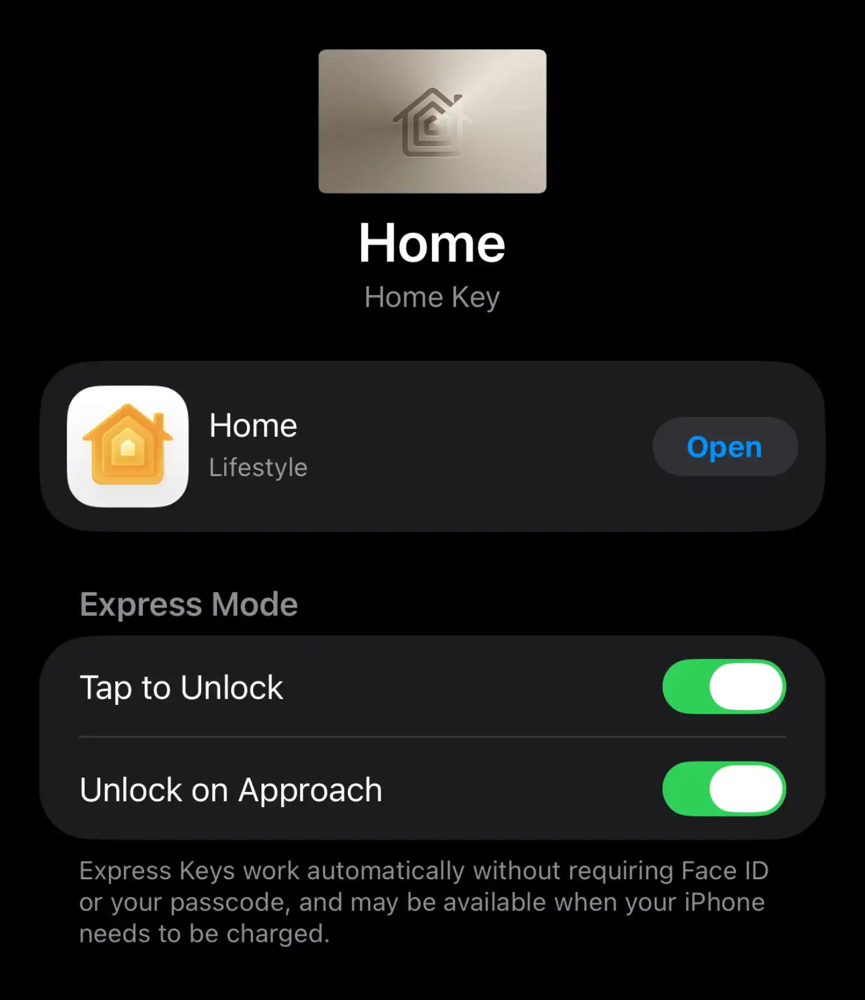
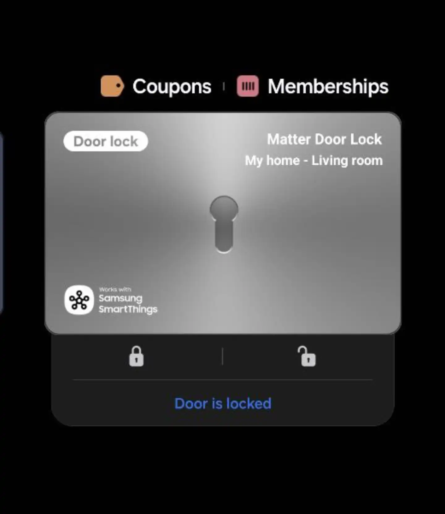
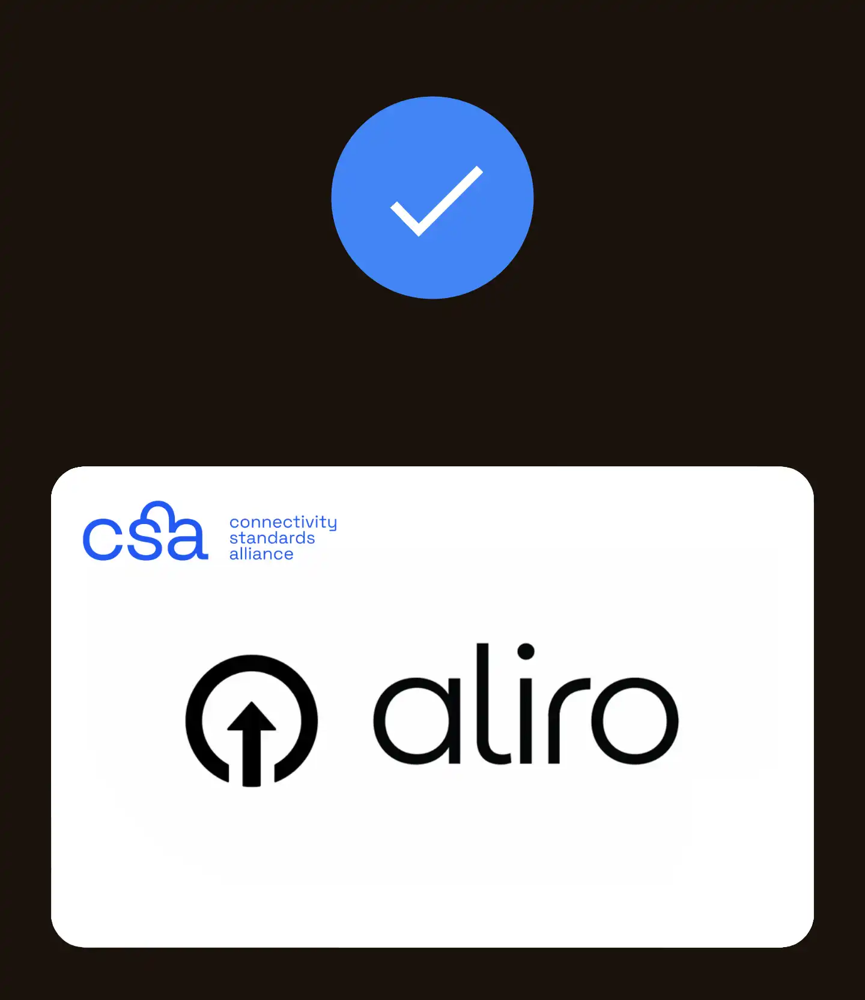
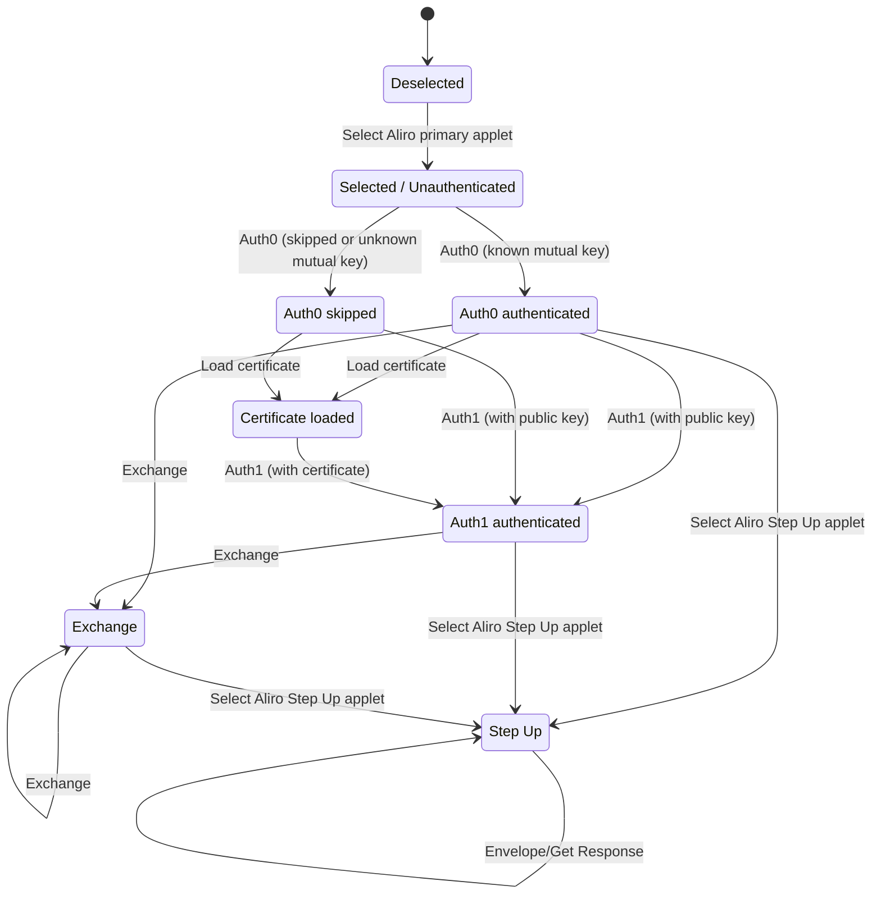

# Aliro

<p float="left">
 
 
 
</p>

> [!NOTE]  
> This repository previously contained observations on the development of the standard. This information has been moved into [OBSERVATIONS.md](OBSERVATIONS.md).

> [!WARNING]
> The technical aspects of the protocol are still being researched and verified, so some information currently present here may be incomplete or partially incorrect.

# Overview

Aliro is an access credential standard developed by the [Connectivity Standards Alliance](https://csa-iot.org) that lets devices present credentials over NFC or BLE + UWB to open doors or authenticate with compatible access systems.

This protocol is based on PKI, with readers and devices performing mutual authentication using public keys and certificates (currently ECDSA), also enabling offline-native credential sharing and revocation.  
Endpoints that have recently completed mutual authentication can reuse the persistent secure context to speed up repeated authentications with symmetric cryptography.  
To preserve privacy, device endpoints withhold identifying data until a reader is authenticated and a secure channel is established.

# Commands

Aliro commands use ISO7816 APDUs over NFC and BLE and largely follow UnifiedAccess protocols such as [CCC CarKey](https://carconnectivity.org/digital-key/) and [Apple HomeKey](https://github.com/kormax/apple-home-key), but with different cryptography, command parameters, and some expanded capabilities:

| Command                     | CLA  | INS  | P1   | P2   | Command Data                          | Le                | Response Data                         | Description                                                                              |
|-----------------------------|------|------|------|------|---------------------------------------|-------------------|---------------------------------------|------------------------------------------------------------------------------------------|
| SELECT ALIRO PRIMARY APPLET | `00` | `A4` | `04` | `00` | `A000000909ACCE5501`                  | `00`              | BER-TLV encoded data                  | Select the primary applet to get a list of supported protocol versions and features      |
| AUTH0                       | `80` | `80` | `00` | `00` | BER-TLV encoded data                  | [empty]           | BER-TLV encoded data                  | Attempt authentication using a cryptogram derived with HMAC-SHA256 over shared data      |
| LOAD CERTIFICATE            | `80` | `D1` | `00` | `00` | ASN.1 encoded certificate             | [empty]           | [empty]                               | Supply a compressed reader certificate signed by the known reader group public key       |
| AUTH1                       | `80` | `81` | `00` | `00` | BER-TLV encoded data                  | [empty]           | Encrypted BER-TLV encoded data        | Authenticate with a known public key or with a key from a supplied, verified certificate |
| EXCHANGE                    | `80` | `C9` | `00` | `00` | Encrypted BER-TLV encoded data        | [empty]           | Encrypted BER-TLV encoded data        | Write or read data from the endpoint's mailbox memory                                    |
| CONTROL FLOW                | `80` | `3C` | `00` | `00` | BER-TLV encoded data                  | [empty]           | [empty]                               | Notify the endpoint about the state of the transaction                                   |
| SELECT ALIRO STEP UP APPLET | `00` | `A4` | `04` | `00` | `A000000909ACCE5502`                  | `00`              | [empty]                               | Select the step-up applet                                                                |
| ENVELOPE                    | `00` | `C3` | `00` | `00` | BER-TLV with nested NDEF or CBOR data | [empty]           | BER-TLV with nested NDEF or CBOR data | Request attestation or revocation certificates from the endpoint                         |
| GET RESPONSE                | `00` | `C0` | `00` | `00` | [empty]                               | [expected length] | Parts of CBOR with encrypted data     | Read leftover certificate data from the previous ENVELOPE request                        |

Running these commands moves the credential-holder endpoint through the following states:

<sub>Deselection or Control Flow is possible in all states, hence it is not displayed in the diagram</sub>

## SELECT ALIRO PRIMARY APPLET

This is an initial command used to select the Aliro applet and receive capability information from the device endpoint.

### Command

#### APDU format

| Field | Value                |
|-------|----------------------|
| CLA   | `00`                 |
| INS   | `A4`                 |
| P1    | `04`                 |
| P2    | `00`                 |
| Lc    | `09`                 |
| Data  | `A000000909ACCE5501` |
| Le    | `00`                 |

### Response

#### APDU format

| Field | Value                        |
|-------|------------------------------|
| Data  | BER-TLV encoded FCI template |
| SW1   | `90`                         |
| SW2   | `00`                         |

#### Data format

Data is formatted as a BER-TLV object:

```text
6F File Control Information (FCI) Template
  84 Dedicated File (DF) Name
    A000000909ACCE5501
  A5 File Control Information (FCI) Proprietary Template
    80 Medium type
      0000
    5C Supported protocol versions
      01000009
    7F66 Additional capabilities
      02 Additional capability tag
        0000
```

- Tag `5C` is an array of 2-byte values indicating supported protocol versions:
  - `0100` → 1.0;
  - `0009` → 0.9.
- Tag `80` lists the medium type; mobile devices use value `0000`;
- Tag `7F66` lists additional capabilities declared by the device endpoint manufacturer as a list of `02` tags. 

The full FCI template is used as input for cryptographic operations in later steps to ensure the reader is informed about the device's full capability set.

## AUTH0

This command is used to exchange ephemeral keys between the device and the reader, with an optional ability to expedite authentication using persistent context.

### Command

#### APDU format

| Field | Value                   |
|-------|-------------------------|
| CLA   | `80`                    |
| INS   | `80`                    |
| P1    | `00`                    |
| P2    | `00`                    |
| Lc    | length(data)            |
| Data  | BER-TLV encoded request |
| Le    | [none]                  |

#### Data format

Data is formatted as an array of BER-TLV values:

```text
41 Transaction flag
  01
42 Transaction code
  01
5C Chosen protocol version
  0100
87 Reader ephemeral public key
  0461C11D6A105738164DFEBE0565CF68E22AD2AF76537F1131A7CB44C6E6FEB4836D20A2F38FAFB9943BC81F22F5855C07D45C2797D82F1888D7976F553C5D41C3
4C Transaction identifier (Transaction nonce)
  44945BB788A4B6A9BE7B72111398E646
4D Reader identifier (Group Identifier + Reader Instance Identifier)
  000102030405060708090A0B0C0D0E0F101112131415161718191A1B1C1D1E1F
```

- Tag `41` encodes transaction flags:
  - `00` Skip FAST authentication, proceeding to STANDARD;
  - `01` Attempt FAST authentication;
- Tag `42` encodes transaction code or action:
  - `00` - Unlock;
  - `01` - Lock.
- Tag `87` contains uncompressed reader ephemeral key;
- Tag `4C` holds a transaction identifier, which serves as a per-transaction nonce;
- Tag `4D` contains the reader identifier, which consists of the reader group identifier (first 16 bytes) and the reader instance identifier (last 16 bytes).

### Response

#### APDU format

| Field | Value                |
|-------|----------------------|
| Data  | BER-TLV encoded data |
| SW1   | `90`                 |
| SW2   | `00`                 |

#### Data format

Data is formatted as an array of BER-TLV values:

```text
86 Device ephemeral public key
  04193AF7945D2125C89B49C95E10AD2CD6EC69D336A24F723E70ECA6B66FD32C394E1599BF8CC4D80459194D96B509DB80432D98F034732D944D77E97E82ADAE9C
9D Device cryptogram
  70DF3315AEF4B219F814C0087F455B09A6F51F28870308447711525C458FB8907DD43A722911E636263988E18C6EDCA6E09245288947388BAA3C8E416B7FCA82
```

- Tag `86` contains uncompressed device ephemeral key;
- Tag `9D` is present only if FAST authentication flow was indicated in request tag `41` and contains a cryptogram generated with HMAC-SHA256 over the context established with this reader during previous communication sessions. In case this context is lost, or it is a first authentication attempt, the device returns bogus data here to preserve privacy.

> [!NOTE]  
> Specifics on cryptogram generation and secure context establishment will be provided later

## LOAD CERTIFICATE

In installations with multiple reader systems, each reader sub-group may be provisioned with a custom key signed by a master reader group key. This command lets the reader provide the device endpoint with a certificate to enable use of a delegated key.

### Command

#### APDU format

| Field | Value                                        |
|-------|----------------------------------------------|
| CLA   | `80`                                         |
| INS   | `D1`                                         |
| P1    | `00`                                         |
| P2    | `00`                                         |
| Lc    | length(data)                                 |
| Data  | ASN.1 encoded certificate in compressed form |
| Le    | [none]                                       |

#### Compressed certificate format

Data is formatted as an ASN.1 object:

```text
30 PKI Message
  04 Profile marker
    0000
  30 PKI Body
    80 Serial number
        03
    81 Issuer
        497373756572
    82 Not before
        3235303130313030303030305A
    83 Not after
        3330303130313030303030305A
    84 Subject
        5375626A656374
    85 Public Key
        0491C9773144B1A677FB6E5C1F8104641452FB15D786CFE4E463A90BB4E5ACF0131FEED4901D0D8DBE8120A3A81EA97640E6C8A90754681E77E6AF850CB7BEDF36
    86 Signature
        3046022100F19D0B011EA957147ADDE8D2C9560114268EA94F6838852AD3D719CBB9F2B086022100DB2B160A8C444C49B212679D7948C66034D215CD1BE70CEC25CB99511F05AAB5
```

For signature validation, the certificate is decompressed into an X.509 DER form by assigning tags to fields in the following fashion:
- serialNumber: `80`;
- issuer:
  - commonName: `81`.
- validity:
  - notBefore: `82`;
  - notAfter: `83`.
- subject:
  - commonName: `84`.
- subjectPublicKeyInfo: `85`;
- signature: `86`.

### Response

#### APDU format

| Field | Value  |
|-------|--------|
| Data  | [none] |
| SW1   | `90`   |
| SW2   | `00`   |

> [!NOTE]  
> Specifics on certificate generation/validation/compression/decompression will be provided later

## AUTH1

Reader generates a signature over the data exchanged previously and presents it to the device.  
In case of a successful verification, a secure context is established between the reader and the device, and the device returns an encrypted response containing its own signature over the common data.

### Command

#### APDU format

| Field | Value                   |
|-------|-------------------------|
| CLA   | `80`                    |
| INS   | `81`                    |
| P1    | `00`                    |
| P2    | `00`                    |
| Lc    | length(data)            |
| Data  | BER-TLV encoded request |
| Le    | [none]                  |

#### Data format

Data is formatted as an array of BER-TLV values:

```text
41 Transaction flag
  01
9E Signature
  12F977A7E2977662F4E0689A677FFAD4500304D23F8FCF6D106014BCFEF54F92C87944950335583C2C37E6C452729D13806BBAC036E3EECC3EACBD7C920E53A1
```

- Tag `41` encodes transaction flags:
  - `00` Endpoint identifier will be returned in response;
  - `01` Endpoint Public Key will be returned in response.
- Tag `9E` contains a signature over the common transaction data.

> [!NOTE]  
> Specifics on signature generation/validation will be provided later

Based on the exchanged data, a secure context is established between the device and the reader.

> [!NOTE]  
> Specifics on secure context key derivation and decryption/encryption will be provided later

### Response

#### APDU format

| Field | Value                  |
|-------|------------------------|
| Data  | Encrypted BER-TLV data |
| SW1   | `90`                   |
| SW2   | `00`                   |

#### Data format

Data is formatted as an array of BER-TLV values:

```text
4E Device identifier
  0001020304050607
5A Device long-term public key
  04A6A168F80FBEBBFAB658B788878C430646495F8CB0B7D2FC544C543ABA60F3BAD0B9F842190A0E7B351A06818A5A8BA4AEAEBEC192CD5CC3FD555E7008F0922A
9E Device signature
  27C1B735028B66DDF80C03E0629FF6A20192725CF4501E19DC95BD2DE94CCDF80D481BD603E01568F5977F67AD5203D482F237E64E6E5899B39C1F529054D1BB
5E Medium identifier
  0000
91 Credential issuance date
  323032352D30382D30315430313A30303A30305A
```

- Tag `4E` contains part of the device identifier; it is only sent if standard authentication is attempted.
- Tag `5A` contains the long-term device public key; it is only sent if fast authentication was attempted.
- Tag `9E` contains a signature over the common transaction data;
- Tag `5E` may contain an identifier for the credential medium;
- Tag `91` contains the credential issuance date.

## EXCHANGE

Using the secure channel established in AUTH0 or AUTH1, the reader may read or write arbitrary data to the endpoint's mailbox.

### Command

#### APDU format

| Field | Value                             |
|-------|-----------------------------------|
| CLA   | `80`                              |
| INS   | `C9`                              |
| P1    | `00`                              |
| P2    | `00`                              |
| Lc    | length(data)                      |
| Data  | Encrypted BER-TLV encoded request |
| Le    | [none]                            |

#### Data format

Data sent by the reader contains a request object that describes a list of operations to perform with a mailbox:

- Tag `87` - read data, consisting of 4 bytes and returning [LENGTH] bytes:
  - OFFSET_HI;
  - OFFSET_LO;
  - LENGTH_HI;
  - LENGTH_LO.
- Tag `8A` - write data, consisting of 2 + length(data) bytes and returning 1 byte:
  - OFFSET_HI;
  - OFFSET_LO;
  - [data].
- Tag `95` - set data, which sets all bytes in the range to the given value; consists of 5 bytes and returns 1 byte:
  - OFFSET_HI;
  - OFFSET_LO;
  - LENGTH_HI;
  - LENGTH_LO;
  - SET_TO_VALUE.
- Tag `97` - indicates whether this is the last command in the atomic session:
  - `01`: last command;
  - `00`: more commands pending.

### Response

#### APDU format

| Field | Value                  |
|-------|------------------------|
| Data  | Encrypted BER-TLV data |
| SW1   | `90`                   |
| SW2   | `00`                   |

When decrypted, the response starts with a 2-byte length field for the encrypted payload, followed by operation results and a trailing status word.

## CONTROL FLOW

This command allows a reader to notify the device about the state or result of the transaction for UX purposes.

### Command

#### APDU format

| Field | Value                   |
|-------|-------------------------|
| CLA   | `80`                    |
| INS   | `3C`                    |
| P1    | `00`                    |
| P2    | `00`                    |
| Lc    | length(data)            |
| Data  | BER-TLV encoded request |
| Le    | [none]                  |

#### Data format

Data is formatted as an array of BER-TLV values:

```text
41 Transaction flag
  01
42 Transaction code
  01
43 Status
  01
```

Tags `41` and `42` mirror the meaning of the same tags in AUTH0 and AUTH1. Tag `43` is optional and provides additional information to the device.

### Response

#### APDU format

| Field | Value  |
|-------|--------|
| Data  | [none] |
| SW1   | `90`   |
| SW2   | `00`   |

## SELECT ALIRO STEP UP APPLET

This command is used after the primary flow has completed in order to retrieve attestation or revocation certificates from the device.

### Command

#### APDU format

| Field | Value                |
|-------|----------------------|
| CLA   | `00`                 |
| INS   | `A4`                 |
| P1    | `04`                 |
| P2    | `00`                 |
| Lc    | `09`                 |
| Data  | `A000000909ACCE5502` |
| Le    | `00`                 |

### Response

#### APDU format

| Field | Value                        |
|-------|------------------------------|
| Data  | BER-TLV encoded FCI template |
| SW1   | `90`                         |
| SW2   | `00`                         |

FCI template value is identical to the one returned by the SELECT ALIRO PRIMARY APPLET command.

## ENVELOPE

This command is used by the reader to request attestation and revocation certificates from the device using the established secure channel.

### Command

#### APDU format

| Field | Value                                 |
|-------|---------------------------------------|
| CLA   | `00`                                  |
| INS   | `C3`                                  |
| P1    | `00`                                  |
| P2    | `00`                                  |
| Lc    | length(data)                          |
| Data  | BER-TLV with nested NDEF or CBOR data |
| Le    | `00`                                  |

> [!NOTE]  
> Request data format requires further investigation and will be provided later

### Response

#### APDU format

| Field | Value                             |
|-------|-----------------------------------|
| Data  | Parts of CBOR with encrypted data |
| SW1   | `90`                              |
| SW2   | `00`                              |

> [!NOTE]  
> Specifics on the decryption/encryption of the certificate data will be provided later

## GET RESPONSE

If a response to ENVELOPE could not fit all the certificate data, this command is used repeatedly until everything is returned.

### Command

#### APDU format

| Field | Value             |
|-------|-------------------|
| CLA   | `00`              |
| INS   | `C0`              |
| P1    | `00`              |
| P2    | `00`              |
| Lc    | `00`              |
| Data  | [none]            |
| Le    | [expected length] |

### Response

#### APDU format

| Field | Value                             |
|-------|-----------------------------------|
| Data  | Parts of CBOR with encrypted data |
| SW1   | `90`                              |
| SW2   | `00`                              |


# Extras

## Protocol versions

Currently, two protocol versions have been observed in the wild:
- `0.9` - Apple/Google Wallet;
- `1.0` - Samsung Wallet.

The differences between the versions are yet unknown; they are suspected to differ in the command formats for EXCHANGE and SELECT STEP UP/ENVELOPE.

## Enhanced Contactless Polling

To enable use of the "Express Mode" feature with Apple devices, the reader has to send a [TCI value that matches the pass](https://web.archive.org/web/20250405102423/https://developers.google.com/wallet/access/multi-family-key/guides/express-mode).  
While the value may be unique for general access installations, Matter-based Aliro locks use a TCI value of `204220`.

For Home installations where both HomeKit and Matter locks are present, the Aliro applet co-resides with the HomeKey applet inside the same pass.  
At the same time, the Aliro applet is not available when express mode is triggered with the HomeKey TCI `021100`, and the HomeKey applet is unavailable when the pass is triggered with the Aliro TCI `204220`.

Similar to HomeKey, the last 8 bytes of the ECP frame must contain the reader group identifier so that the device can auto-present the pass when TRA is active or express mode is disabled.

## Polling Loop Annotations

To support automatic credential use on newer Android devices, compatible readers have to broadcast appropriate [Polling Loop Annotations](https://web.archive.org/web/20250405102423/https://developers.google.com/wallet/access/multi-family-key/guides/express-mode).

Considering that Android's Observe Mode feature is compatible with readers that use any annotation format, Samsung and Google Wallet may piggyback on existing formats like ECP, or use a custom one for readers that are Android-only.

# References

* General information:
  - [Connectivity Standards Alliance - Aliro](https://csa-iot.org/all-solutions/aliro/);
  - [Apple Business Register - Apple Wallet Access Program](https://register.apple.com/resources/docs/apple-pay/access/program-guide/overview/access-passes/);
  - [Google - Express Mode For an Enhanced User Experience](https://web.archive.org/web/20250405102423/https://developers.google.com/wallet/access/multi-family-key/guides/express-mode);
  - [Samsung - Door Locks on SmartThings x Samsung Wallet](https://developer.samsung.com/conference/sdc24/sessions/door-locks-on-smartthings-x-samsung-wallet).
* Researched Wallet Applications & system modules:
  - [Samsung Wallet](https://play.google.com/store/apps/details?id=com.samsung.android.spay);
  - [Samsung Digital Key Services](https://www.apkmirror.com/apk/samsung-electronics-co-ltd/samsung-pass-3/);
  - [Google Wallet](https://play.google.com/store/apps/details?id=com.google.android.apps.walletnfcrel);
  - [Google Play Services](https://play.google.com/store/apps/details?id=com.google.android.gms).
