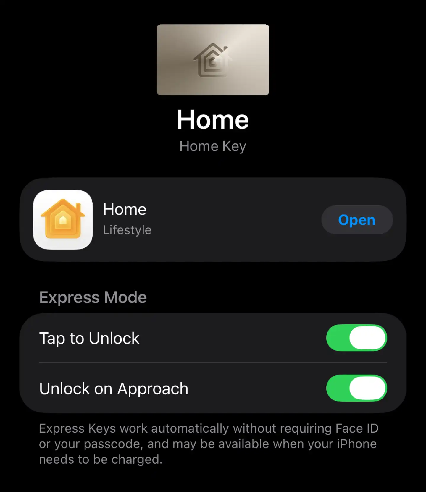
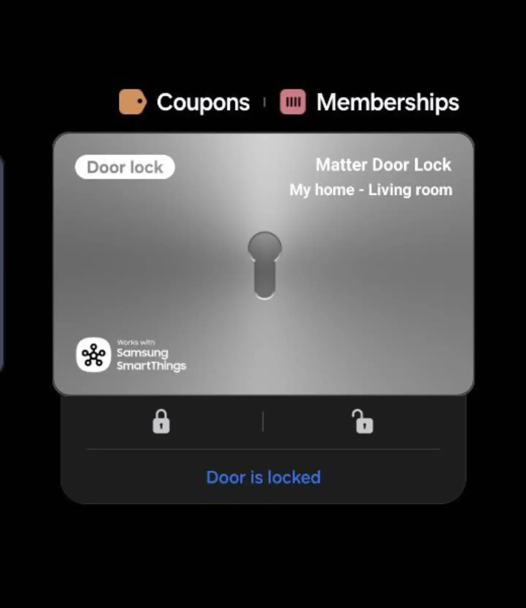
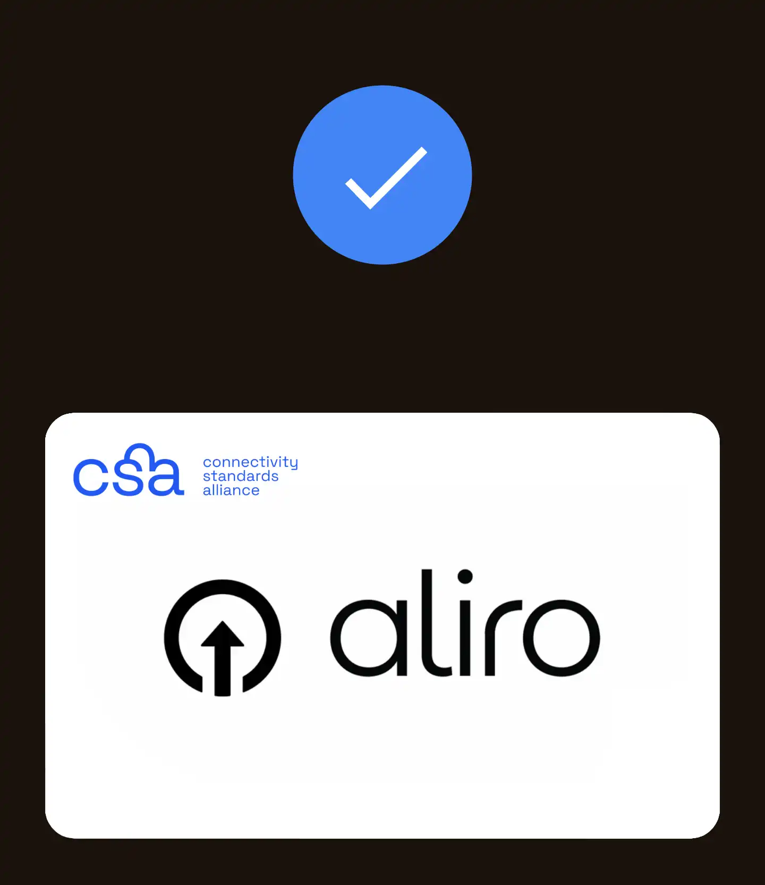
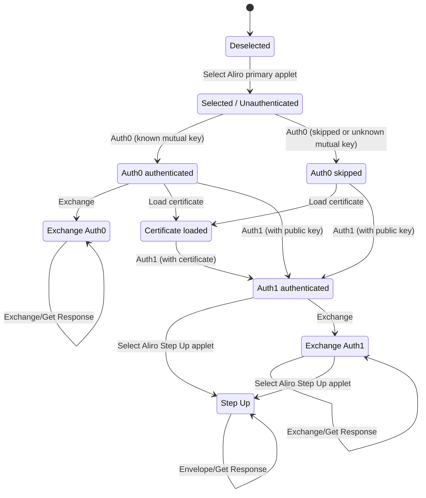

# Aliro

<p float="left">
 
 
 
</p>

> [!Note]
> On February 26, 2026, the Connectivity Standards Alliance announced the release of Aliro 1.0: [Introducing Aliro 1.0: A Unified Standard to Transform the Access Control Ecosystem](https://csa-iot.org/newsroom/introducing-aliro-1-0-a-unified-standard-to-transform-the-access-control-ecosystem/).

> [!NOTE]  
> This repository previously contained observations on the development of the standard. This information has been moved into [OBSERVATIONS.md](OBSERVATIONS.md).

# Overview

Aliro is an access credential standard developed by the [Connectivity Standards Alliance](https://csa-iot.org) that lets devices present credentials over NFC or BLE + UWB to open doors or authenticate with compatible access systems.

This protocol is based on PKI, with readers and devices performing mutual authentication using public keys and certificates (currently ECDSA), also enabling offline-native credential sharing and revocation.  
Endpoints that have recently completed mutual authentication can reuse the persistent secure context to speed up repeated authentications with symmetric cryptography.  
To preserve privacy, device endpoints withhold identifying data until a reader is authenticated and a secure channel is established.

# Commands

Aliro commands use ISO7816 APDUs over NFC and BLE and largely follow UnifiedAccess protocols such as [CCC CarKey](https://carconnectivity.org/digital-key/) and [Apple HomeKey](https://github.com/kormax/apple-home-key), but with different cryptography, command parameters, and some expanded capabilities:

| Command                     | CLA  | INS  | P1   | P2   | Command Data                   | Le                | Response Data                     | Description                                                                              |
|-----------------------------|------|------|------|------|--------------------------------|-------------------|-----------------------------------|------------------------------------------------------------------------------------------|
| SELECT ALIRO PRIMARY APPLET | `00` | `A4` | `04` | `00` | `A000000909ACCE5501`           | `00`              | BER-TLV encoded data              | Select the primary applet to get a list of supported protocol versions and features      |
| AUTH0                       | `80` | `80` | `00` | `00` | BER-TLV encoded data           | [empty]           | BER-TLV encoded data              | Attempt authentication and optionally request a FAST cryptogram tied to a shared context |
| LOAD CERTIFICATE            | `80` | `D1` | `00` | `00` | ASN.1 encoded certificate      | [empty]           | [empty]                           | Supply a compressed reader certificate signed by the known reader group public key       |
| AUTH1                       | `80` | `81` | `00` | `00` | BER-TLV encoded data           | [empty]           | Encrypted BER-TLV encoded data    | Authenticate with a known public key or with a key from a supplied, verified certificate |
| EXCHANGE                    | `80` | `C9` | `00` | `00` | Encrypted BER-TLV encoded data | [empty]           | Encrypted data                    | Write or read data from the endpoint's mailbox memory                                    |
| CONTROL FLOW                | `80` | `3C` | `00` | `00` | BER-TLV encoded data           | [empty]           | [empty]                           | Notify the endpoint about the state of the transaction                                   |
| SELECT ALIRO STEP UP APPLET | `00` | `A4` | `04` | `00` | `A000000909ACCE5502`           | `00`              | BER-TLV encoded data              | Select the step-up applet                                                                |
| ENVELOPE                    | `00` | `C3` | `00` | `00` | BER-TLV with nested CBOR data  | [empty] or `00`   | BER-TLV with nested CBOR data     | Request attestation or revocation certificates from the endpoint                         |
| GET RESPONSE                | `00` | `C0` | `00` | `00` | [empty]                        | [expected length] | Remaining encrypted response data | Read leftover response bytes after a command returns `61 xx`                             |

Running these commands moves the credential-holder endpoint through the following states:

```mermaid
stateDiagram-v2
  state "Deselected" as Deselected
  state "Selected / Unauthenticated" as Unauth
  state "Auth0 authenticated" as Auth0Auth
  state "Auth0 skipped" as Auth0Skip
  state "Certificate loaded" as LoadCert
  state "Auth1 authenticated" as Auth1Auth
  state "Step Up" as StepUp
  state "Exchange Auth0" as ExchangeAuth0
  state "Exchange Auth1" as ExchangeAuth1

  [*] --> Deselected
  Deselected --> Unauth : Select Aliro primary applet
  Unauth --> Auth0Auth : Auth0 (known mutual key)
  Unauth --> Auth0Skip : Auth0 (skipped or unknown mutual key)

  Auth0Auth --> ExchangeAuth0 : Exchange
  ExchangeAuth0 --> ExchangeAuth0 : Exchange/Get Response
  Auth0Auth --> LoadCert : Load certificate
  Auth0Auth --> Auth1Auth : Auth1 (with public key)

  Auth0Skip --> LoadCert : Load certificate
  Auth0Skip --> Auth1Auth : Auth1 (with public key)

  LoadCert --> Auth1Auth : Auth1 (with certificate)

  Auth1Auth --> StepUp : Select Aliro Step Up applet
  Auth1Auth --> ExchangeAuth1 : Exchange

  ExchangeAuth1 --> ExchangeAuth1 : Exchange/Get Response
  ExchangeAuth1 --> StepUp : Select Aliro Step Up applet

  StepUp --> StepUp : Envelope/Get Response
```
<sub>Deselection or Control Flow is possible in all states, so it is not displayed in the diagram.</sub>

## Secure Channel

Aliro secure messaging uses directional AES-GCM keys and per-direction counters.  
Channel keys are derived during authentication and then reused by EXCHANGE, ENVELOPE, and GET RESPONSE.

Aliro uses three secure channels with different keys and independent state:
- NFC Exchange
- BLE Exchange
- StepUp

Each channel uses a reader/device key pair generated as a result of AUTH0 or AUTH1.

| Item                    | Value                                 |
|-------------------------|---------------------------------------|
| Cipher                  | AES-GCM                               |
| Authentication tag size | `16` bytes (`128` bits)               |
| IV format               | `[MODE (8 bytes)] [COUNTER (4 bytes)]` |
| Reader mode prefix      | `0000000000000000`                    |
| Endpoint mode prefix    | `0000000000000001`                    |

- Reader encrypts outbound command payload with the channel's `SKReader`.
- Endpoint encrypts outbound response payload with the channel's `SKDevice`.
- Reader decrypts inbound responses with `SKDevice`; endpoint decrypts inbound commands with `SKReader`.
- Counters are maintained per direction and incremented after each encrypted message.
- If a response returns `61xx`, use GET RESPONSE to collect remaining encrypted chunks before final payload processing.

Example (Python pseudocode):

```python
from cryptography.hazmat.primitives.ciphers import Cipher, algorithms, modes

READER_MODE = bytes.fromhex("0000000000000000")
ENDPOINT_MODE = bytes.fromhex("0000000000000001")


def encrypt_aes_gcm(key: bytes, iv: bytes, plaintext: bytes) -> bytes:
    assert len(iv) == 12, "IV must be 12 bytes for GCM mode"
    encryptor = Cipher(algorithms.AES(key), modes.GCM(iv)).encryptor()
    return encryptor.update(plaintext) + encryptor.finalize() + encryptor.tag


def decrypt_aes_gcm(key: bytes, iv: bytes, ciphertext: bytes) -> bytes:
    encrypted, tag = ciphertext[:-16], ciphertext[-16:]
    decryptor = Cipher(algorithms.AES(key), modes.GCM(iv, tag)).decryptor()
    return decryptor.update(encrypted) + decryptor.finalize()


class AliroSecureChannel:
    def __init__(
        self,
        sk_reader: bytes,
        sk_device: bytes,
        counter_reader: int = 1,
        counter_endpoint: int = 1,
    ):
        self.sk_reader = sk_reader
        self.sk_device = sk_device
        self.counter_reader = counter_reader
        self.counter_endpoint = counter_endpoint

    def encrypt_reader_data(self, plaintext: bytes) -> bytes:
        # Use when the reader sends encrypted payload to the endpoint.
        iv = READER_MODE + self.counter_reader.to_bytes(4, "big")
        ciphertext = plaintext if not plaintext else encrypt_aes_gcm(self.sk_reader, iv, plaintext)
        self.counter_reader += 1
        return ciphertext

    def decrypt_reader_data(self, ciphertext: bytes) -> bytes:
        # Use when endpoint-side logic needs to decrypt reader-originated payload.
        iv = READER_MODE + self.counter_reader.to_bytes(4, "big")
        plaintext = ciphertext if not ciphertext else decrypt_aes_gcm(self.sk_reader, iv, ciphertext)
        self.counter_reader += 1
        return plaintext

    def encrypt_endpoint_data(self, plaintext: bytes) -> bytes:
        # Use when the endpoint sends encrypted payload back to the reader.
        iv = ENDPOINT_MODE + self.counter_endpoint.to_bytes(4, "big")
        ciphertext = plaintext if not plaintext else encrypt_aes_gcm(self.sk_device, iv, plaintext)
        self.counter_endpoint += 1
        return ciphertext

    def decrypt_endpoint_data(self, ciphertext: bytes) -> bytes:
        # Use when reader-side logic decrypts endpoint-originated payload.
        iv = ENDPOINT_MODE + self.counter_endpoint.to_bytes(4, "big")
        plaintext = ciphertext if not ciphertext else decrypt_aes_gcm(self.sk_device, iv, ciphertext)
        self.counter_endpoint += 1
        return plaintext
```

## SELECT ALIRO PRIMARY APPLET

This is an initial command used to select the Aliro applet and receive capability information from the device endpoint.

### Command

#### APDU format

| Field | Value                |
|-------|----------------------|
| CLA   | `00`                 |
| INS   | `A4`                 |
| P1    | `04`                 |
| P2    | `00`                 |
| Lc    | `09`                 |
| Data  | `A000000909ACCE5501` |
| Le    | `00`                 |

### Response

#### APDU format

| Field | Value                        |
|-------|------------------------------|
| Data  | BER-TLV encoded FCI template |
| SW1   | `90`                         |
| SW2   | `00`                         |

#### Data format

Data is formatted as a BER-TLV object:

```text
6F File Control Information (FCI) Template
  84 Dedicated File (DF) Name
    A000000909ACCE5501
  A5 File Control Information (FCI) Proprietary Template
    80 Medium type
      0000
    5C Supported protocol versions
      01000009
    7F66 Additional capabilities
      02 Additional capability tag
        0000
```

- Tag `5C` is an array of 2-byte values indicating supported protocol versions:
  - `0100` → 1.0;
  - `0009` → 0.9.
- Tag `80` lists the medium type; mobile devices use value `0000`;
- Tag `7F66` lists additional capabilities declared by the device endpoint manufacturer as a list of `02` tags. 

The full FCI template is used as input for cryptographic operations in later steps to ensure the reader is informed about the device's full capability set.

## AUTH0

This command is used to exchange ephemeral keys between the device and the reader, with an optional ability to expedite authentication using persistent context.

### Command

#### APDU format

| Field | Value                   |
|-------|-------------------------|
| CLA   | `80`                    |
| INS   | `80`                    |
| P1    | `00`                    |
| P2    | `00`                    |
| Lc    | length(data)            |
| Data  | BER-TLV encoded request |
| Le    | [none]                  |

#### Data format

Data is formatted as an array of BER-TLV values:

```text
41 Transaction flag
  01
42 Transaction code
  01
5C Chosen protocol version
  0100
87 Reader ephemeral public key
  0461C11D6A105738164DFEBE0565CF68E22AD2AF76537F1131A7CB44C6E6FEB4836D20A2F38FAFB9943BC81F22F5855C07D45C2797D82F1888D7976F553C5D41C3
4C Transaction identifier (Transaction nonce)
  44945BB788A4B6A9BE7B72111398E646
4D Reader identifier (Group Identifier + Reader Instance Identifier)
  000102030405060708090A0B0C0D0E0F101112131415161718191A1B1C1D1E1F
```

- Tag `41` encodes transaction flags:
  - `00` Skip FAST authentication, proceeding to STANDARD;
  - `01` Attempt FAST authentication;
- Tag `42` encodes transaction code or action:
  - `00` - Unlock;
  - `01` - Lock.
- Tag `87` contains uncompressed reader ephemeral key;
- Tag `4C` holds a transaction identifier, which serves as a per-transaction nonce;
- Tag `4D` contains the reader identifier, which consists of the reader group identifier (first 16 bytes) and the reader instance identifier (last 16 bytes).

### Response

#### APDU format

| Field | Value                |
|-------|----------------------|
| Data  | BER-TLV encoded data |
| SW1   | `90`                 |
| SW2   | `00`                 |

#### Data format

Data is formatted as an array of BER-TLV values:

```text
86 Device ephemeral public key
  04193AF7945D2125C89B49C95E10AD2CD6EC69D336A24F723E70ECA6B66FD32C394E1599BF8CC4D80459194D96B509DB80432D98F034732D944D77E97E82ADAE9C
9D Device cryptogram
  70DF3315AEF4B219F814C0087F455B09A6F51F28870308447711525C458FB8907DD43A722911E636263988E18C6EDCA6E09245288947388BAA3C8E416B7FCA82
```

- Tag `86` contains uncompressed device ephemeral key;
- Tag `9D` is present only if FAST authentication flow was indicated in request tag `41` and contains authenticated cryptogram data tied to the context established with this reader during previous communication sessions. In case this context is lost, or it is a first authentication attempt, the device returns bogus data here to preserve privacy.

#### Secure channel key derivation

To validate tag `9D`, the reader attempts cryptogram decryption by deriving FAST key material from transaction data for each provisioned endpoint's persistent key in memory, until a match is found, or the list is exhausted.

| Element                  | Value                                                  | Length (bytes) | Notes                                                     |
|--------------------------|--------------------------------------------------------|----------------|-----------------------------------------------------------|
| Reader long-term key X   | `reader_public_key_x`                                  | `32`           | X coordinate                                              |
| Domain separator         | `"VolatileFast"`                                       | `12`           | ASCII context label                                       |
| Reader identifier        | `reader_group_identifier + reader_instance_identifier` | `32`           | Group + instance identifier                               |
| Transport type           | `transport_type`                                       | `1`            | NFC/contactless (`0x5E`)                                  |
| Protocol version         | `BerTLV(0x5C, protocol_version)`                       | `4`            | Encoded TLV (`5C 02 vv vv`) for selected protocol version |
| Reader ephemeral key X   | `reader_ephemeral_public_key_x`                        | `32`           | X coordinate                                              |
| Transaction identifier   | `transaction_identifier`                               | `16`           | Per-transaction nonce                                     |
| Transaction params       | `transaction_flags + transaction_code`                 | `2`            | AUTH flags + operation                                    |
| FCI data                 | `fci_proprietary_template`                             | `variable`     | FCI proprietary template bytes                            |
| Endpoint long-term key X | `endpoint_public_key_x`                                | `32`           | X coordinate                                              |

Cryptogram-verification keying material is derived directly with HKDF-SHA256 using:
* Endpoint persistent key as IKM
* Serialized shared data as salt
* Endpoint ephemeral key X as info.

The output keying material is used to derive the following keys:
* Cryptogram SK
* Exchange SK Reader
* Exchange SK Device
* Bluetooth SK Reader
* Bluetooth SK Device
* UWB Ranging SK

StepUp channel keys are not generated with AUTH0, continuing the auth flow to AUTH1 is required in that case.

Example (Python pseudocode):

```python
from pseudocode import BerTLV, to_bytes

from cryptography.hazmat.primitives import hashes
from cryptography.hazmat.primitives.kdf.hkdf import HKDF


endpoint_persistent_key: bytes = ...


def hkdf_sha256(ikm: bytes, salt: bytes, info: bytes, length: int) -> bytes:
    return HKDF(
        algorithm=hashes.SHA256(),
        length=length,
        salt=to_bytes(salt),
        info=to_bytes(info),
    ).derive(ikm)


shared_data = to_bytes([
    reader_public_key_x,
    "VolatileFast",
    reader_group_identifier + reader_instance_identifier,
    transport_type,
    BerTLV(0x5C, value=protocol_version),
    reader_ephemeral_public_key_x,
    transaction_identifier,
    [transaction_flags, transaction_code],
    fci_proprietary_template,
    endpoint_public_key_x,
])

okm = hkdf_sha256(
    endpoint_persistent_key,
    shared_data,
    endpoint_ephemeral_public_key_x,
    key_size * 10,
)

cryptogram_sk = okm[0x00:0x20]

exchange_sk_reader = okm[0x20:0x40]
exchange_sk_device = okm[0x40:0x60]

ble_input_material = okm[0x60:0x80]

uwb_ranging_sk = okm[0x80:0xA0]

ble_sk_reader = hkdf_sha256(
    ble_input_material,
    b"\x00" * 32,
    b"BleSKReader",
    key_size * 2,
)
ble_sk_device = hkdf_sha256(
    ble_input_material,
    b"\x00" * 32,
    b"BleSKDevice",
    key_size * 2,
)
```

Using the derived `cryptogram_sk`, reader can attempt to decrypt the cryptogram using AES-GCM with zero-IV:

```python
from cryptography.hazmat.primitives.ciphers import Cipher, algorithms, modes

iv = b"\x00" * 12
ciphertext, tag = cryptogram[:-16], cryptogram[-16:]
decryptor = Cipher(
    algorithms.AES(cryptogram_sk),
    modes.GCM(iv, tag),
).decryptor()
plaintext = decryptor.update(ciphertext) + decryptor.finalize()
```

Successful decryption equals successful authentication, thanks to AES-GCM's authenticated encryption mode.

Decrypted cryptogram is formatted as BER-TLV and contains the following tags:

| Tag  | Field                 | Expected length (bytes) | Notes                                      |
|------|-----------------------|-------------------------|--------------------------------------------|
| `5E` | Authentication status | `2`                     | Endpoint auth status value                 |
| `91` | Issued at             | `20`                    | All-zero bytes if issuance date is unset   |
| `92` | Expires at            | `20`                    | All-zero bytes if expiration date is unset |


## LOAD CERTIFICATE

In installations with multiple reader systems, each reader sub-group may be provisioned with a custom key signed by a master reader group key. This command lets the reader provide the device endpoint with a certificate to enable use of a delegated key.

### Command

#### APDU format

| Field | Value                                        |
|-------|----------------------------------------------|
| CLA   | `80`                                         |
| INS   | `D1`                                         |
| P1    | `00`                                         |
| P2    | `00`                                         |
| Lc    | length(data)                                 |
| Data  | ASN.1 encoded certificate in compressed form |
| Le    | [none]                                       |

#### Compressed certificate format

Data is formatted as an ASN.1 object:

```text
30 PKI Message
  04 Profile marker
    0000
  30 PKI Body
    80 Serial number
        03
    81 Issuer
        497373756572
    82 Not before
        3235303130313030303030305A
    83 Not after
        3330303130313030303030305A
    84 Subject
        5375626A656374
    85 Public Key
        0491C9773144B1A677FB6E5C1F8104641452FB15D786CFE4E463A90BB4E5ACF0131FEED4901D0D8DBE8120A3A81EA97640E6C8A90754681E77E6AF850CB7BEDF36
    86 Signature
        3046022100F19D0B011EA957147ADDE8D2C9560114268EA94F6838852AD3D719CBB9F2B086022100DB2B160A8C444C49B212679D7948C66034D215CD1BE70CEC25CB99511F05AAB5
```

For signature validation, the certificate is decompressed into an X.509 DER form by assigning tags to fields in the following fashion:
- serialNumber: `80`;
- issuer:
  - commonName: `81`.
- validity:
  - notBefore: `82`;
  - notAfter: `83`.
- subject:
  - commonName: `84`.
- subjectPublicKeyInfo: `85`;
- signature: `86`.

### Response

#### APDU format

| Field | Value  |
|-------|--------|
| Data  | [none] |
| SW1   | `90`   |
| SW2   | `00`   |

> [!NOTE]  
> Specifics on certificate generation/validation/compression/decompression will be provided later

## AUTH1

Reader generates a signature over the data exchanged previously and presents it to the device.  
In case of a successful verification, a secure context is established between the reader and the device, and the device returns an encrypted response containing its own signature over the common data.

### Command

#### APDU format

| Field | Value                   |
|-------|-------------------------|
| CLA   | `80`                    |
| INS   | `81`                    |
| P1    | `00`                    |
| P2    | `00`                    |
| Lc    | length(data)            |
| Data  | BER-TLV encoded request |
| Le    | [none]                  |

#### Data format

Data is formatted as an array of BER-TLV values:

```text
41 Transaction flag
  01
9E Signature
  12F977A7E2977662F4E0689A677FFAD4500304D23F8FCF6D106014BCFEF54F92C87944950335583C2C37E6C452729D13806BBAC036E3EECC3EACBD7C920E53A1
```

- Tag `41` encodes transaction flags:
  - `00` Endpoint identifier will be returned in response;
  - `01` Endpoint Public Key will be returned in response.
- Tag `9E` contains a signature over the common transaction data.

#### Reader signature generation

Reader signature input is constructed as a BER-TLV sequence, then signed with ECDSA over SHA-256.

| Tag  | Field                           | Value bytes   | TLV bytes | Notes                                                          |
|------|---------------------------------|---------------|-----------|----------------------------------------------------------------|
| `4D` | Reader identifier               | `32`          | `34`      | reader_group_identifier (16) + reader_instance_identifier (16) |
| `86` | Endpoint ephemeral public key X | `32`          | `34`      | X coordinate only                                              |
| `87` | Reader ephemeral public key X   | `32`          | `34`      | X coordinate only                                              |
| `4C` | Transaction identifier          | `16`          | `18`      | Per-transaction nonce                                          |
| `93` | Domain separator                | `4`           | `6`       | Constant value `415D9569`                                      |

The reader signs the serialized preimage using ECDSA with SHA-256, encodes the signature as raw `r || s` (`32 + 32 = 64` bytes), and places the resulting 64-byte value into command tag `9E`.

Example (Python pseudocode):

```python
from pseudocode import BerTLV, to_bytes
from cryptography.hazmat.primitives import hashes
from cryptography.hazmat.primitives.asymmetric import ec
from cryptography.hazmat.primitives.asymmetric.utils import (
    decode_dss_signature,
)


reader_private_key: ec.EllipticCurvePrivateKey = ...

reader_signature_input = to_bytes([
    BerTLV(0x4D, value=reader_group_identifier + reader_instance_identifier),
    BerTLV(0x86, value=endpoint_ephemeral_public_key_x),
    BerTLV(0x87, value=reader_ephemeral_public_key_x),
    BerTLV(0x4C, value=transaction_identifier),
    BerTLV(0x93, value=bytes.fromhex("415D9569")),
])

signature_der = reader_private_key.sign(
  reader_signature_input,
  ec.ECDSA(hashes.SHA256())
)

r, s = decode_dss_signature(signature_der)

signature = r.to_bytes(32, "big") + s.to_bytes(32, "big")
```

#### Secure channel key derivation

To generate secure channel keys, the following shared data is assembled from transaction information:

| Element                | Value                                                  | Length (bytes)  | Notes                                                     |
|------------------------|--------------------------------------------------------|-----------------|-----------------------------------------------------------|
| Reader long-term key X | `reader_public_key_x`                                  | `32`            | X coordinate                                              |
| Domain separator       | `"Volatile****"`                                       | `12`            | ASCII context label                                       |
| Reader identifier      | `reader_group_identifier + reader_instance_identifier` | `32`            | Group + instance identifier                               |
| Transport type         | `transport_type`                                       | `1`             | NFC/contactless (`0x5E`) in current implementation        |
| Protocol version       | `BerTLV(0x5C, protocol_version)`                       | `4`             | Encoded TLV (`5C 02 vv vv`) for selected protocol version |
| Reader ephemeral key X | `reader_ephemeral_public_key_x`                        | `32`            | X coordinate                                              |
| Transaction identifier | `transaction_identifier`                               | `16`            | Per-transaction nonce                                     |
| Transaction params     | `transaction_flags + transaction_code`                 | `2`             | AUTH flags + operation                                    |
| FCI data               | `fci_proprietary_template`                             | `variable`      | FCI proprietary template bytes                            |

Shared key is generated by performing ECDH with reader and endpoint ephemeral keys, then an intermediate key is derived with X9.63 KDF using transaction identifier as shared info.

Secure-channel keying material is derived with HKDF-SHA256 using:
* Intermediate key as IKM
* Serialized shared data as salt
* Endpoint ephemeral key X as info.

That keying material is used to derive the following keys: 
* Exchange SK Reader
* Exchange SK Device
* StepUp SK Reader
* StepUp SK Device
* Bluetooth SK Reader
* Bluetooth SK Device
* UWB Ranging SK


Example (Python pseudocode):

```python
from pseudocode import BerTLV, to_bytes

from cryptography.hazmat.primitives import hashes
from cryptography.hazmat.primitives.asymmetric import ec
from cryptography.hazmat.primitives.kdf.hkdf import HKDF
from cryptography.hazmat.primitives.kdf.x963kdf import X963KDF


reader_ephemeral_private_key: ec.EllipticCurvePrivateKey = ...
endpoint_ephemeral_public_key: ec.EllipticCurvePublicKey = ...


def hkdf_sha256(ikm: bytes, salt: bytes, info: bytes, length: int) -> bytes:
    return HKDF(
        algorithm=hashes.SHA256(),
        length=length,
        salt=to_bytes(salt),
        info=to_bytes(info),
    ).derive(ikm)


shared_key = reader_ephemeral_private_key.exchange(
  ec.ECDH(),
  endpoint_ephemeral_public_key
)

derived_key = X963KDF(
    algorithm=hashes.SHA256(),
    length=32,
    sharedinfo=transaction_identifier,
).derive(shared_key)


shared_data = to_bytes([
    reader_public_key_x,
    "Volatile****",
    reader_group_identifier + reader_instance_identifier,
    transport_type,
    BerTLV(0x5C, value=protocol_version),
    reader_ephemeral_public_key_x,
    transaction_identifier,
    [transaction_flags, transaction_code],
    fci_proprietary_template,
])

info = to_bytes([endpoint_ephemeral_public_key_x])

okm = hkdf_sha256(
    derived_key,
    shared_data,
    info,
    key_size * 10,
)

exchange_sk_reader = okm[0x00:0x20]
exchange_sk_device = okm[0x20:0x40]

step_up_input_material = okm[0x40:0x60]
ble_input_material = okm[0x60:0x80]

uwb_ranging_sk = okm[0x80:0xA0]

step_up_sk_reader = hkdf_sha256(
    step_up_input_material,
    b"\x00" * 32,
    b"SKReader",
    key_size * 2,
)
step_up_sk_device = hkdf_sha256(
    step_up_input_material,
    b"\x00" * 32,
    b"SKDevice",
    key_size * 2,
)

ble_sk_reader = hkdf_sha256(
    ble_input_material,
    b"\x00" * 32,
    b"BleSKReader",
    key_size * 2,
)
ble_sk_device = hkdf_sha256(
    ble_input_material,
    b"\x00" * 32,
    b"BleSKDevice",
    key_size * 2,
)
```

Based on the exchanged data, a secure context is established between the device and the reader.

### Response

#### APDU format

| Field | Value                  |
|-------|------------------------|
| Data  | Encrypted BER-TLV data |
| SW1   | `90`                   |
| SW2   | `00`                   |

#### Data format

Data is formatted as an array of BER-TLV values:

```text
4E Device identifier
  0001020304050607
5A Device long-term public key
  04A6A168F80FBEBBFAB658B788878C430646495F8CB0B7D2FC544C543ABA60F3BAD0B9F842190A0E7B351A06818A5A8BA4AEAEBEC192CD5CC3FD555E7008F0922A
9E Device signature
  27C1B735028B66DDF80C03E0629FF6A20192725CF4501E19DC95BD2DE94CCDF80D481BD603E01568F5977F67AD5203D482F237E64E6E5899B39C1F529054D1BB
5E Authentication status
  0000
91 Credential issuance date
  323032352D30382D30315430313A30303A30305A
```

- Tag `4E` contains part of the device identifier; it is only sent if requested in tag `41`;
- Tag `5A` contains the long-term device public key; it is only sent if requested in tag `41`;
- Tag `9E` contains a signature over the common transaction data;
- Tag `5E` contains authentication status;
- Tag `91` contains the credential issuance date.

#### AUTH1 response signature verification

Device signature verification input is constructed as a BER-TLV sequence:

| Tag  | Field                           | Value bytes | TLV bytes | Notes                                                  |
|------|---------------------------------|-------------|-----------|--------------------------------------------------------|
| `4D` | Reader identifier               | `32`        | `34`      | `reader_group_identifier + reader_instance_identifier` |
| `86` | Endpoint ephemeral public key X | `32`        | `34`      | X coordinate only                                      |
| `87` | Reader ephemeral public key X   | `32`        | `34`      | X coordinate only                                      |
| `4C` | Transaction identifier          | `16`        | `18`      | Per-transaction nonce                                  |
| `93` | Domain separator                | `4`         | `6`       | Constant value `4E887B4C`                              |

Example (Python pseudocode):

```python
from pseudocode import (
    BerTLV,
    BerTLVMessage,
    to_bytes,
)

from cryptography.hazmat.primitives import hashes
from cryptography.hazmat.primitives.asymmetric import ec
from cryptography.hazmat.primitives.asymmetric.utils import encode_dss_signature


endpoint_public_key: ec.EllipticCurvePublicKey = ...
auth1_response_message: BerTLVMessage = ...

signature_raw = auth1_response_message.find_by_tag_else_throw(0x9E).value

signature_der = encode_dss_signature(
    int.from_bytes(signature_raw[:32], "big"),
    int.from_bytes(signature_raw[32:], "big"),
)

verification_input = to_bytes([
    BerTLV(0x4D, value=reader_group_identifier + reader_instance_identifier),
    BerTLV(0x86, value=endpoint_ephemeral_public_key_x),
    BerTLV(0x87, value=reader_ephemeral_public_key_x),
    BerTLV(0x4C, value=transaction_identifier),
    BerTLV(0x93, value=bytes.fromhex("4E887B4C")),
])

endpoint_public_key.verify(
    signature_der,
    verification_input,
    ec.ECDSA(hashes.SHA256()),
)
```

#### Persistent key derivation

After AUTH1 response decryption and signature verification succeed, the endpoint persistent key is derived from the AUTH1 intermediate key and stored for subsequent AUTH0 FAST attempts.

| Element                  | Value                                                   | Length (bytes) | Notes                                                     |
|--------------------------|---------------------------------------------------------|----------------|-----------------------------------------------------------|
| Reader long-term key X   | `reader_public_key_x`                                   | `32`           | X coordinate                                              |
| Domain separator         | `"Persistent**"`                                        | `12`           | ASCII context label                                       |
| Reader identifier        | `reader_group_identifier + reader_instance_identifier`  | `32`           | Group + instance identifier                               |
| Transport type           | `transport_type`                                        | `1`            | NFC/contactless (`0x5E`)                                  |
| Protocol version         | `BerTLV(0x5C, protocol_version)`                        | `4`            | Encoded TLV (`5C 02 vv vv`) for selected protocol version |
| Reader ephemeral key X   | `reader_ephemeral_public_key_x`                         | `32`           | X coordinate                                              |
| Transaction identifier   | `transaction_identifier`                                | `16`           | Per-transaction nonce                                     |
| Transaction params       | `transaction_flags + transaction_code`                  | `2`            | AUTH flags + operation                                    |
| FCI data                 | `fci_proprietary_template`                              | `variable`     | FCI proprietary template bytes                            |
| Endpoint long-term key X | `endpoint_public_key_x`                                 | `32`           | X coordinate                                              |

Persistent key material is derived with HKDF-SHA256 using:
* AUTH1 intermediate key (`derived_key`) as IKM
* Serialized shared data as salt
* Endpoint ephemeral key X as info.

If AUTH1 is not run again for a given endpoint, that endpoint's stored persistent key remains unchanged.

Example (Python pseudocode):

```python
from pseudocode import BerTLV, to_bytes

from cryptography.hazmat.primitives import hashes
from cryptography.hazmat.primitives.kdf.hkdf import HKDF


def hkdf_sha256(ikm: bytes, salt: bytes, info: bytes, length: int) -> bytes:
    return HKDF(
        algorithm=hashes.SHA256(),
        length=length,
        salt=to_bytes(salt),
        info=to_bytes(info),
    ).derive(ikm)


shared_data = to_bytes([
    reader_public_key_x,
    "Persistent**",
    reader_group_identifier + reader_instance_identifier,
    transport_type,
    BerTLV(0x5C, value=protocol_version),
    reader_ephemeral_public_key_x,
    transaction_identifier,
    [transaction_flags, transaction_code],
    fci_proprietary_template,
    endpoint_public_key_x,
])

endpoint_persistent_key = hkdf_sha256(
    derived_key,
    shared_data,
    endpoint_ephemeral_public_key_x,
    0x20,
)
```

## EXCHANGE

Using the [secure channel](#secure-channel) established in AUTH0 or AUTH1, the reader may read arbitrary data from, or write arbitrary data to, the endpoint's mailbox.

### Command

#### APDU format

| Field | Value                             |
|-------|-----------------------------------|
| CLA   | `80`                              |
| INS   | `C9`                              |
| P1    | `00`                              |
| P2    | `00`                              |
| Lc    | length(data)                      |
| Data  | Encrypted BER-TLV encoded request |
| Le    | [none]                            |

#### Data format

Data sent by the reader is wrapped in a single top-level TLV container with tag `BA`.  
The container value is a request object that describes a list of operations to perform with a mailbox:

- Tag `87` - read data, consisting of 4 bytes and returning 2 + [LENGTH] bytes:
  - `OFFSET_HI`;
  - `OFFSET_LO`;
  - `LENGTH_HI`;
  - `LENGTH_LO`.
- Tag `8A` - write data, consisting of 2 + [LENGTH] bytes:
  - `OFFSET_HI`;
  - `OFFSET_LO`;
  - [data].
- Tag `95` - set data, which sets all bytes in the range to the given value; consists of 5 bytes:
  - `OFFSET_HI`;
  - `OFFSET_LO`;
  - `LENGTH_HI`;
  - `LENGTH_LO`;
  - `SET_TO_VALUE`.
- Tag `8C` - indicates whether this is the last command in the atomic session:
  - `00`: last command;
  - `01`: more commands pending.

### Response

#### APDU format

| Field | Value                            |
|-------|----------------------------------|
| Data  | Encrypted data                   |
| SW1   | `61` (more data) or `90` (final) |
| SW2   | `00`                             |

#### Data format

After secure-channel decryption, EXCHANGE response plaintext is:

```text
[READ_RESULTS...][00][02][STATUS_HI][STATUS_LO]
```

- `READ_RESULTS` contains zero or more read result entries;
- trailing `00 02` indicates a fixed 2-byte status field length;
- `STATUS_HI/STATUS_LO` is the operation-batch result code.

Read result entries are appended in request order, each in the following format:

```text
[LEN_HI][LEN_LO][READ_DATA...]
```

In current implementation, tags `8A` (write) and `95` (set) do not append per-operation bytes to the response payload.

When EXCHANGE returns `61 00`, the reader should continue with GET RESPONSE and append returned chunks until `90 00`.

Observed status codes:

| Status word | Meaning                             |
|-------------|-------------------------------------|
| `0000`      | Success                             |
| `0001`      | Mailbox read range is out of bounds |
| `0002`      | Invalid/malformed EXCHANGE payload  |

## CONTROL FLOW

This command allows a reader to notify the device about the state or result of the transaction for UX purposes.

### Command

#### APDU format

| Field | Value                   |
|-------|-------------------------|
| CLA   | `80`                    |
| INS   | `3C`                    |
| P1    | `00`                    |
| P2    | `00`                    |
| Lc    | length(data)            |
| Data  | BER-TLV encoded request |
| Le    | [none]                  |

#### Data format

Data is formatted as an array of BER-TLV values:

```text
41 Transaction flag
  01
42 Transaction code
  01
43 Status
  01
```

Tags `41` and `42` mirror the meaning of the same tags in AUTH0 and AUTH1. Tag `43` is optional and provides additional information to the device.

### Response

#### APDU format

| Field | Value  |
|-------|--------|
| Data  | [none] |
| SW1   | `90`   |
| SW2   | `00`   |

## SELECT ALIRO STEP UP APPLET

This command is used after the primary flow has completed in order to retrieve attestation or revocation certificates from the device.

### Command

#### APDU format

| Field | Value                |
|-------|----------------------|
| CLA   | `00`                 |
| INS   | `A4`                 |
| P1    | `04`                 |
| P2    | `00`                 |
| Lc    | `09`                 |
| Data  | `A000000909ACCE5502` |
| Le    | `00`                 |

### Response

#### APDU format

| Field | Value                        |
|-------|------------------------------|
| Data  | BER-TLV encoded FCI template |
| SW1   | `90`                         |
| SW2   | `00`                         |

FCI template value is similar to the one returned by the SELECT ALIRO PRIMARY APPLET command.

## ENVELOPE

This command is used by the reader to request attestation and revocation certificates from the device using the established [secure channel](#secure-channel).

### Command

#### APDU format

| Field | Value                         |
|-------|-------------------------------|
| CLA   | `00`                          |
| INS   | `C3`                          |
| P1    | `00`                          |
| P2    | `00`                          |
| Lc    | length(data)                  |
| Data  | BER-TLV with nested CBOR data |
| Le    | [empty] or `00`               |

#### Data format

Command data is wrapped in a top-level BER-TLV tag `53`.  
The value of tag `53` is a CBOR object that carries encrypted request bytes in the `data` field.

### Response

#### APDU format

| Field | Value                                                 |
|-------|-------------------------------------------------------|
| Data  | BER-TLV payload chunk with nested encrypted CBOR data |
| SW1   | `61` (more data) or `90` (final)                      |
| SW2   | remaining length if SW1 is `61`, else `00`            |

When `SW1=61`, the reader should continue with GET RESPONSE and append returned chunks until `SW1=90`.

> [!NOTE]  
> Depending on the device implementation, BER-TLV response payload may use either layout:
> - CBOR object with a `data` field that contains the encrypted CBOR bytes.
> - Encrypted CBOR bytes directly at the outer layer, without the extra `data` wrapper.

## GET RESPONSE

If EXCHANGE or ENVELOPE return `61 XX`, this command is used repeatedly until all data is returned.

### Command

#### APDU format

| Field | Value             |
|-------|-------------------|
| CLA   | `00`              |
| INS   | `C0`              |
| P1    | `00`              |
| P2    | `00`              |
| Lc    | `00`              |
| Data  | [none]            |
| Le    | [expected length] |

### Response

#### APDU format

| Field | Value                                      |
|-------|--------------------------------------------|
| Data  | Next chunk of encrypted response bytes     |
| SW1   | `61` (more data) or `90` (final)           |
| SW2   | remaining length when `SW1=61`, else `00`  |

For ENVELOPE, returned chunks carry BER-TLV with encrypted CBOR payload.  
For EXCHANGE, returned chunks carry encrypted EXCHANGE response bytes.


# Extras

## Protocol versions

Currently, two protocol versions have been observed in the wild:
- `0.9` - Apple Wallet; Google Wallet;
- `1.0` - Apple Wallet (since 26.4); Samsung Wallet.

Primary protocol commands, including SELECT, AUTH0, AUTH1, and underlying cryptography, seem to be unaffected by the chosen protocol version.
The difference is suspected to be present in the command formats for EXCHANGE and ENVELOPE.

## Enhanced Contactless Polling

To enable use of the "Express Mode" feature with Apple devices, the reader has to send a [TCI value that matches the pass](https://web.archive.org/web/20250405102423/https://developers.google.com/wallet/access/multi-family-key/guides/express-mode).  
While the value may be unique for general access installations, Matter-based Aliro locks use a TCI value of `204220`.

For Home installations where both HomeKit and Matter locks are present, the Aliro applet co-resides with the HomeKey applet inside the same pass.  
At the same time, the Aliro applet is not available when express mode is triggered with the HomeKey TCI `021100`, and the HomeKey applet is unavailable when the pass is triggered with the Aliro TCI `204220`.

Similar to HomeKey, the last 8 bytes of the ECP frame must contain the reader group identifier so that the device can auto-present the pass when TRA is active or express mode is disabled.

## Polling Loop Annotations

To support automatic credential use on newer Android devices, compatible readers have to broadcast appropriate [Polling Loop Annotations](https://web.archive.org/web/20250405102423/https://developers.google.com/wallet/access/multi-family-key/guides/express-mode).

Considering that Android's Observe Mode feature is compatible with readers that use any annotation format, Samsung and Google Wallet may piggyback on existing formats like ECP, or use a custom one for readers that are Android-only.

# References

* General information:
  - [Connectivity Standards Alliance - Aliro](https://csa-iot.org/all-solutions/aliro/);
  - [Apple Business Register - Apple Wallet Access Program](https://register.apple.com/resources/docs/apple-pay/access/program-guide/overview/access-passes/);
  - [Google - Express Mode For an Enhanced User Experience](https://web.archive.org/web/20250405102423/https://developers.google.com/wallet/access/multi-family-key/guides/express-mode);
  - [Samsung - Door Locks on SmartThings x Samsung Wallet](https://developer.samsung.com/conference/sdc24/sessions/door-locks-on-smartthings-x-samsung-wallet).
* Researched Wallet Applications & system modules:
  - [Samsung Wallet](https://play.google.com/store/apps/details?id=com.samsung.android.spay);
  - [Samsung Digital Key Services](https://www.apkmirror.com/apk/samsung-electronics-co-ltd/samsung-pass-3/);
  - [Google Wallet](https://play.google.com/store/apps/details?id=com.google.android.apps.walletnfcrel);
  - [Google Play Services](https://play.google.com/store/apps/details?id=com.google.android.gms).
